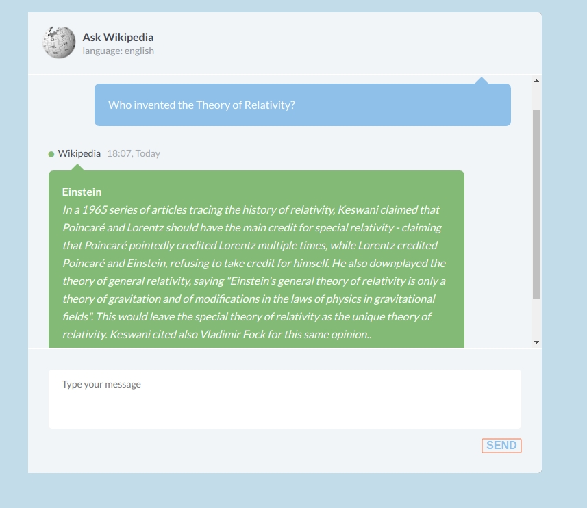

# DrQA
[DrQA](https://github.com/facebookresearch/DrQA.git) is a PyTorch implementation of the DrQA system described in the ACL 2017 paper [Reading Wikipedia to Answer Open-Domain Questions](https://arxiv.org/abs/1704.00051).

# DrQA Web UIx
This is a project that provides an interface to interact with DrQA.

It extends [drqa-webui](https://github.com/zaghaghi/drqa-webui)
adding support for in-memory caching using [Redis Cache](https://redis.io) and providing a different UI. 

# Installing
DrQA Web UIx requires Linux/OSX and Python 3.5 or higher. 

1. Install DrQA
2. Install Redis
3. Install dependencies (`pip install -r requirements`)
4. Set `drqa_data_directory` in `services\__init__.py` to data directory of DrQA
5. Start Redis (`systemctl start redis`)
6. Start App (`gunicorn --timeout 300 index:app`)
7. Open [http://localhost:8000](http://localhost:8000)

# Screens

<p align="center"></p>

```